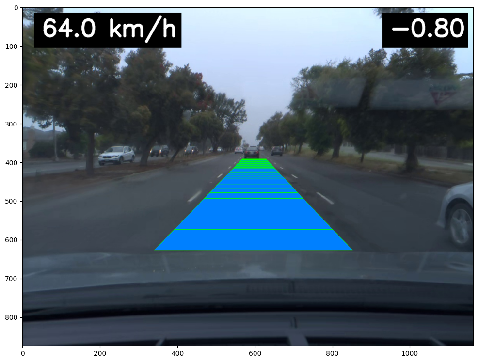

<p align="center">
  
</p>

<p align="center">
    open-source autonomous vehicle software&nbsp | <a href="https://asandei.com"> website</a>&nbsp
<br>

This repository contains training and inference code for the Steer family of models. These are end-to-end neural networks for self driving.

## dependencies

Most notably:
- pytorch >= 2.0
- numpy
- opencv
- wandb

```
pip3 install -r requirements.txt
```

## quick start

First of all, read and configure the option from `./config`. The `data.json` file has options for processing the dataset, turn on the `debug` option to only download a few samples instead of the full 80gb dataset.

To download & preprocess the dataset, run:

```
python3 ./src/prepare.py
```

To start training the model:

```
python3 ./src/train.py
```

## dataset

The dataset used is comma2k19, by Comma AI. It consists of 2019 segments of recorded driving information across a highway in California. The preprocessing script extracts the relevant information, such as steering angles (radians), speed (m/s) and frame location data (position, orientation - converted to local frame reference).



Debug information projected into a sample frame from the dataset.

## training

**model** | **loss** | **steps** | **batch size** | **frames ctx**
:--------:|:--------:|:---------:|:--------------:|:-------------:
 PilotNet |    -     |    500    |      128       |      3/30
 Seq2Seq  |    -     |    500    |       32       |      3/30
**Steer** |    -     |    500    |      128       |      3/30

The presented model is **Steer**, however for comparison, also PilotNet and Seq2Seq models have been developed.

The first model is based on the PilotNet architecture. It has two main components: a series of convolutional layers and a series of feed forward layers, acting as a controller. The frames are concatanated and feed into the conv layers, after that the features are concatenated with the past path. The resulted tensor is then passed thru the linear layers, later branching into multiple linear output layers to create predictions. This model proved effective in roughly estimating the steering angle and the speed of the vehicle, however it presented poor results in predicting a future path. However, the model did understand to predict the vehicle will go (about) in the forward direction. This inability to predict the path can be caused by the lack of temporal features.

The sequence to sequence model is composed of an encoder and a decoder. The encoder has a RegNet at its code, which extracts image features. These features are computed for each frame in the sequence, and after they are concatenated with the past path, they are passed to the decoder. The decoder uses a GRU network to process the sequence and make predictions. Thanks to its sequential nature, the decoder can extract spatial information and make better predictions.

[steer-15-09-2024-r3.webm](https://github.com/user-attachments/assets/f9702535-d440-406e-81ac-6f1424419517)

## license

[Apache 2](LICENSE) © 2024 [Asandei Stefan-Alexandru](https://asandei.com). All rights reserved.
